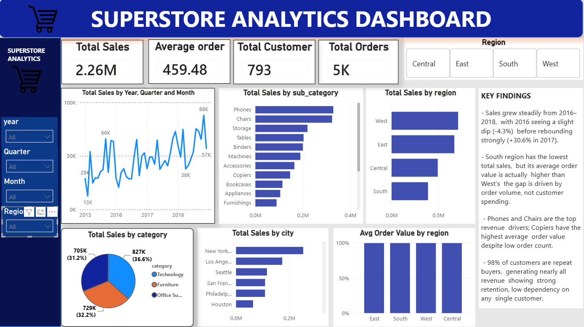
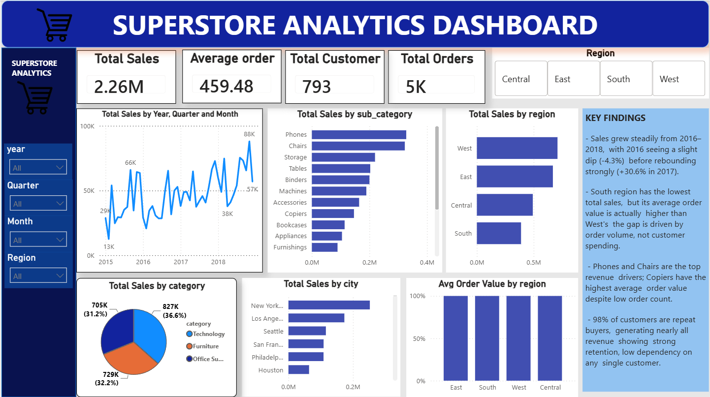
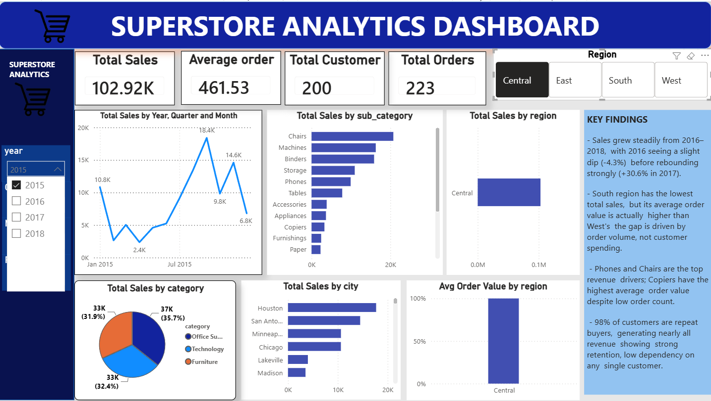
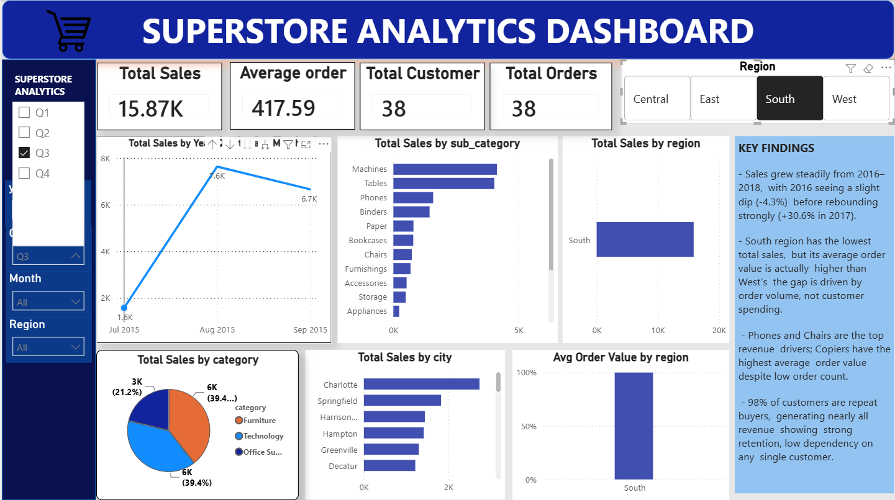

# Superstore Sales Analysis

An end-to-end data analytics project built on the Superstore Sales dataset (2015-2018), covering the full pipeline from raw data to a business-ready dashboard: PostgreSQL for querying, Python/Pandas for cleaning and investigation, and Power BI for the final interactive dashboard.

The focus of this project wasn't just producing charts — it was working through the same process a real analyst goes through: verifying data before trusting it, catching a genuine data quality bug, and turning raw numbers into recommendations someone could actually act on.

Dataset source: [Superstore Sales Dataset (Kaggle)](https://www.kaggle.com/datasets/rohitsahoo/sales-forecasting)

---

## Dashboard



*Additional Dashboard Views:*
- **Sales Performance:** 
- **Product & Category Analysis:** 
- **Customer Segmentation:** 

---

## Project Structure

```
├── image/
│   ├── d1.png
│   ├── d2.png
│   ├── d3.png
│   └── dashboard.png
├── notebooks/
│   ├── data_analysis.ipynb
│   └── data_exploration.ipynb
├── README.md
├── superstore.csv
├── superstore.pbix
├── superstore_clean.csv
└── train.csv
```

---

## Tools Used

- PostgreSQL
- Python (Pandas, SQLAlchemy, Matplotlib)
- Power BI (Power Query, DAX, Data Modeling)

---

## Part 1: SQL — PostgreSQL

Raw data was loaded into PostgreSQL first, with `row_id` set as the primary key (not `order_id`, since one order can span multiple product rows).

### Regional sales performance

```sql
SELECT
    region,
    COUNT(DISTINCT order_id) AS total_orders,
    ROUND(SUM(sales), 2) AS total_sales,
    ROUND(SUM(sales) / COUNT(DISTINCT order_id), 2) AS avg_sales_per_order
FROM superstore
GROUP BY region
ORDER BY total_sales DESC;
```

Finding: South region had the lowest total sales, but its average order value was actually higher than West's and Central's. The revenue gap is driven by order volume, not customer spending.

### Year-over-year growth

```sql
SELECT
    year,
    total_sales,
    ROUND(
        (total_sales - LAG(total_sales) OVER (ORDER BY year))
        / LAG(total_sales) OVER (ORDER BY year) * 100, 1
    ) AS yoy_growth_pct
FROM (
    SELECT
        EXTRACT(YEAR FROM order_date) AS year,
        SUM(sales) AS total_sales
    FROM superstore
    GROUP BY EXTRACT(YEAR FROM order_date)
) yearly_sales
ORDER BY year;
```

Finding: Sales dipped 4.3% in 2016, then grew 30.6% in 2017 and 20.3% in 2018 — real growth, but decelerating.

### Category and sub-category performance

```sql
SELECT
    category,
    sub_category,
    COUNT(DISTINCT order_id) AS total_orders,
    ROUND(SUM(sales), 2) AS total_sales,
    ROUND(SUM(sales) / COUNT(DISTINCT order_id), 2) AS avg_sale_per_order
FROM superstore
GROUP BY category, sub_category
ORDER BY total_sales DESC;
```

Finding: Phones and Chairs generate the most total revenue, but Copiers stand out on a different metric — only 66 orders, yet the highest average order value ($2,216) of any sub-category.

### Repeat vs. one-time customers

```sql
SELECT
    CASE
        WHEN order_count = 1 THEN 'One-time buyer'
        ELSE 'Repeat buyer'
    END AS customer_type,
    COUNT(*) AS num_customers,
    SUM(total_sales) AS total_sales_from_group
FROM (
    SELECT
        customer_id,
        COUNT(DISTINCT order_id) AS order_count,
        SUM(sales) AS total_sales
    FROM superstore
    GROUP BY customer_id
) customer_summary
GROUP BY customer_type;
```

Finding: 98.4% of customers are repeat buyers, generating 99.8% of total revenue.

### Customer concentration

```sql
SELECT
    customer_name,
    ROUND(SUM(sales), 2) AS total_sales,
    ROUND(SUM(sales) * 100.0 / SUM(SUM(sales)) OVER (), 2) AS pct_of_total_sales
FROM superstore
GROUP BY customer_name
ORDER BY total_sales DESC
LIMIT 10;
```

Finding: The top 10 customers account for only 6.8% of total revenue — retention-driven, but not dependent on any single account.

---

## Part 2: Python — Cleaning and Data Quality Investigation

The cleaned table was pulled from PostgreSQL into Pandas using SQLAlchemy for deeper cleaning, investigation, and visualization.

### The shipping date issue

While building a `shipping_days` column (`ship_date - order_date`), the average shipping time came out to over 12 days, with negative minimum values — a sign something was wrong.

```python
df['order_date'] = pd.to_datetime(df['order_date'])
df['ship_date'] = pd.to_datetime(df['ship_date'])
df['shipping_days'] = (df['ship_date'] - df['order_date']).dt.days
```

Investigation steps:
- Checked raw date values directly — ruled out a day/month parsing bug, since dates were already stored in unambiguous ISO format.
- Found that 17.8% of unique orders had a `ship_date` earlier than `order_date` — too large a share to be random data entry error.
- Tested whether the issue was concentrated by year or by shipping mode — both came back essentially flat (roughly 15-18% in every slice), ruling out a specific time period or shipping carrier as the cause.
- Concluded this was a structural issue in the source data, documented it, and excluded these rows from shipping-time calculations only, while keeping them for sales/revenue analysis.

```python
df['shipping_days_valid'] = df['shipping_days'] >= 0
df.loc[~df['shipping_days_valid'], 'shipping_days'] = None
```

After cleaning, shipping times followed the expected order (Same Day < First Class < Second Class < Standard Class), but a large mean-median gap remained (for example, Standard Class: mean 52.8 days vs. median 6 days) — a reminder that averages can be misleading when a dataset has a long tail, and medians told the more honest story.

### Visualizations

- Year-over-year sales trend
- Sales by region
- Sales by sub-category
- Monthly sales trend (seasonality check)

```python
monthly_sales = df.groupby(df['order_date'].dt.to_period('M'))['sales'].sum()
monthly_sales.plot(kind='line', color='purple')
```

The cleaned dataset was saved both to a `superstore_clean` PostgreSQL table and as a CSV export, ready for Power BI.

---

## Part 3: Power BI

The interactive Power BI dashboard is saved as `superstore.pbix` in the root of the repository. It connects directly to the `superstore_clean` PostgreSQL table (CSV included as a portable backup).

Data model:
- A dedicated Date table built with `CALENDAR()` in DAX, linked to `order_date`, enabling year/quarter/month drilldowns
- Core measures: `Total Sales`, `Total Orders`, `Total Customers`, `Avg Order Value`

```dax
Total Sales = SUM(superstore_clean[sales])
Total Orders = DISTINCTCOUNT(superstore_clean[order_id])
Total Customers = DISTINCTCOUNT(superstore_clean[customer_id])
Avg Order Value = DIVIDE([Total Sales], [Total Orders])
```

Dashboard includes:
- KPI cards: Total Sales, Total Orders, Total Customers, Avg Order Value
- Sales trend over time, drillable by year/quarter/month
- Sales by Region and Avg Order Value by Region shown side by side, to surface the South region finding directly
- Sales by Sub-Category (treemap)
- Repeat vs. one-time customer split
- Top 10 customers table
- Slicers for Region, Category, and Year (range slider)
- A written key findings and recommendations panel alongside the visuals

---

## Key Findings

South region's issue is reach, not spending.
South has the lowest total sales ($389K vs. West's $710K), but its average order value ($480) is higher than West's ($448) and Central's ($426). The gap comes from fewer orders (810 vs. West's 1,587), not smaller ones — pointing to a customer acquisition problem, not a pricing one.

Growth is real but slowing down.
Sales fell 4.3% in 2016, then grew 30.6% in 2017 and 20.3% in 2018. Still growing, but at a decreasing rate — an important distinction for forecasting.

Two different product strategies exist in this data.
High-frequency, low-price items (Binders, Paper) drive volume and repeat engagement. Low-frequency, high-price items (Copiers, at $2,216 average order value from just 66 orders) represent underexplored high-value potential.

The business is retention-driven and low-risk.
98.4% of customers are repeat buyers, generating 99.8% of revenue, and that revenue isn't concentrated — the top 10 customers make up only 6.8% of total sales.

---

## Recommendations

- Focus on marketing reach and customer acquisition in the South region rather than discounting.
- Explore ways to increase order volume for high-value, low-frequency products like Copiers and Machines.
- Prioritize retention programs over aggressive new-customer acquisition, given the strength of the existing repeat-purchase base.
- Report shipping performance using median rather than mean shipping time, and treat the roughly 18% of orders with anomalous shipping dates as a separate data quality issue worth raising with the data source owner.

---

## How to Reproduce

1. Clone this repository
2. Load `superstore_clean.csv` into PostgreSQL, or use it directly as a local CSV data source
3. Open `notebooks/data_exploration.ipynb` and `notebooks/data_analysis.ipynb` to follow the cleaning and investigation process
4. Open `superstore.pbix` in Power BI Desktop and point the data source to your PostgreSQL instance or the local CSV file

---

## Author

Sujal — BIM Student, Tribhuvan University
Built as an independent portfolio project for Data Analyst / Junior MIS Executive internship applications.
